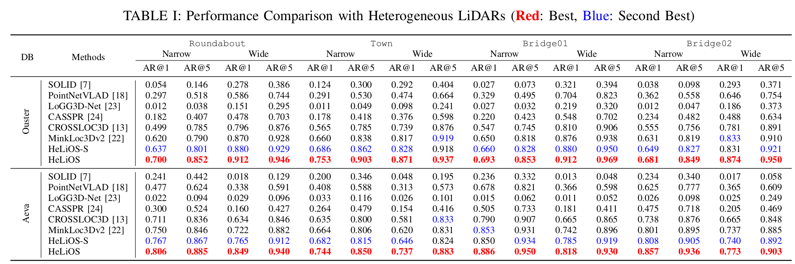

# HeLiPR-Place-Recognition

## Introduction

This repository is dedicated to comparing different place recognition methods on the [HeLiPR dataset](https://sites.google.com/view/heliprdataset). We provide code for the following methods:

| Method         | Status     |
|----------------|------------|
| PointNetVLAD   | To Do      |
| MinkLoc3Dv2    | To Do      |
| LoGG3D-Net     | To Do      |
| CROSSLOC3D     | 24.09.24   |
| CASSPR         | 24.09.25   |
| SOLID          | 24.09.24   |
| HeLiOS         | To Do      |

### Method Details

- **[PointNetVLAD](https://arxiv.org/abs/1804.03492)**: Deep Point Cloud Based Retrieval for Large-Scale Place Recognition [[Original Code]](https://github.com/cattaneod/PointNetVlad-Pytorch) (CVPR 2018)
- **[MinkLoc3Dv2](https://arxiv.org/pdf/2203.00972v1)**: Improving Point Cloud Based Place Recognition with Ranking-based Loss and Large Batch Training [[Original Code]](https://github.com/jac99/MinkLoc3Dv2) (ICPR 2022)
- **[LoGG3D-Net](https://arxiv.org/abs/2109.08336)**: Locally Guided Global Descriptor Learning for 3D Place Recognition [[Original Code]](https://github.com/csiro-robotics/LoGG3D-Net) (ICRA 2021)
- **[CrossLoc3D](https://arxiv.org/abs/2303.17778)**: Aerial-Ground Cross-Source 3D Place Recognition [[Original Code]](https://github.com/rayguan97/crossloc3d) (ICCV 2023)
- **[CASSPR](https://arxiv.org/abs/2211.12542)**: Cross Attention Single Scan Place Recognition [[Original Code]](https://github.com/Yan-Xia/CASSPR) (ICCV 2023)
- **[SOLID](https://arxiv.org/abs/2408.07330)**: Spatially Organized and Lightweight Global Descriptor for FOV-constrained LiDAR Place Recognition [[Original Code]](https://github.com/sparolab/solid) (RA-L 2024)
- **HeLiOS**: Heterogeneous LiDAR Place Recognition via Overlap-based Learning and Local Spherical Transformer [[Original Code]](https://github.com/minwoo0611/HeLiOS) (ICRA 2025 submission)

## Comparison on the HeLiPR Dataset



This table showcases a comparison of different methods on the **HeLiPR** dataset using 3D point cloud data with 8,192 points per scan. To ensure fairness, we utilize identical parameter settings across all methods. **Average Recall@1** and **Average Recall@5** are used as evaluation metrics, with each value representing the average 4 to 6 results in the HeLiPR dataset.

### Dataset Details

- **Ouster - Narrow** (Narrow FOV LiDAR data from the Ouster sensor)
  - **Database**: `Seq01-Ouster`
  - **Query**: `Seq01-Aeva`, `Seq01-Livox`, `Seq02-Aeva`, `Seq02-Livox`, `Seq03-Aeva`, `Seq03-Livox`

- **Aeva - Wide** (Wide FOV LiDAR data from the Aeva sensor)
  - **Database**: `Seq01-Aeva`
  - **Query**: `Seq01-Ouster`, `Seq01-Velodyne`, `Seq02-Ouster`, `Seq02-Velodyne`, `Seq03-Ouster`, `Seq03-Velodyne`

For the **Bridge** Seqs, we grouped `Bridge01-04` and `Bridge02-03` to ensure sufficient overlap between the database and query scans. In the `Bridge01-04` cases:

- **Ouster - Narrow**
  - **Database**: `Seq01-Ouster`
  - **Query**: `Seq01-Ouster`, `Seq01-Velodyne`, `Seq02-Ouster`, `Seq02-Velodyne`

## Usage

**Note (2024/09/24):** Currently, only the validation code for each method has been tested. The training code will be tested and updated soon.

### Download the Validation Dataset

Please download the validation dataset from [here](https://drive.google.com/drive/folders/10wXhjOnKlhkxm3a1Td34YdtNJCRFxIoZ?usp=drive_link). This link contains:

- Sampled point cloud data from the HeLiPR dataset (Roundabout, Town, and Bridge)
- Checkpoint files for each method
- Overlap matrix files

Each scan contains 8,192 points and is sampled at 5m intervals. If you wish to test custom settings, please use the [HeLiPR-Pointcloud-Toolbox](https://github.com/minwoo0611/HeLiPR-Pointcloud-Toolbox).

### Directory Structure

Place the sequences, overlap matrices, and checkpoint files in the `data_validation/`, `data_overlap/`, and `data_ckpt/` folders, respectively. The directory structure should look like:

```
HeLiPR-Place-Recognition
├── model_X
├── data_validation
│   ├── SequenceA-Sensor1
│   │   ├── LiDAR
│   │   │   ├── time0.bin
│   │   │   ├── time1.bin
│   │   │   └── ...
│   │   └── trajectory.csv
│   ├── SequenceB-Sensor2
│   │   ├── LiDAR
│   │   │   ├── time0.bin
│   │   │   ├── time1.bin
│   │   │   └── ...
│   │   └── trajectory.csv
│   └── ...
├── data_overlap
│   ├── overlap_matrix_validation_SequenceA.txt
│   ├── overlap_matrix_validation_SequenceB.txt
│   └── ...
├── data_ckpt
│   ├── X_ckpt.pth
│   ├── Y_ckpt.pth
│   └── ...
```

### Steps to Run the Validation Code

We provide a `Dockerfile` for each method. You can build the Docker image and execute the code within a Docker container. We tested this code on an NVIDIA RTX 3090 and 3080 GPU.

#### 1. Build the Docker Image and Start the Container

```bash
docker build -t helipr_evaluation .
docker run --gpus all -dit --env="DISPLAY" --net=host --ipc=host \
    --volume="/tmp/.X11-unix:/tmp/.X11-unix:rw" \
    -v /:/mydata --volume /dev/:/dev/ \
    helipr_evaluation:latest /bin/bash
```

*Note:* You can adjust the Docker run command according to your environment.

#### 2. Clone the Repository

```bash
git clone https://github.com/minwoo0611/HeLiPR-Place-Recognition
cd HeLiPR-Place-Recognition
```

#### 3. Generate Pickle Files for the HeLiPR Dataset

Before proceeding, ensure that you've downloaded the validation dataset and placed it in the appropriate folders as described above.

Run the following script:

```bash
python generate_test_sets.py
```

In the `generate_test_sets.py` script, modify the following variables to match your data setup:

- `base_path`: Base directory where your data is located
- `overlap_matrix`: Name of the overlap matrix file
- `location`: Name of the sequence
- `db_folder`: Database sequence-sensor
- `query_folder`: Query sequence-sensor

After running the script, you should find two files in `base_path`:

- `helipr_validation_db.pickle`
- `helipr_validation_query.pickle`

#### 4. Run the Validation Code for Each Method

Navigate to the directory of the method you wish to test and follow the instructions in its `README.md`.

```bash
cd model_X
# Follow the instructions in model_X/README.md
```

## Citation

If you find this repository useful, please cite the following papers:

```bibtex
@article{jung2024heteropr,
  author={Minwoo Jung and Sangwoo Jung and Hyeonjae Gil and Ayoung Kim},
  title={HeLiOS: Heterogeneous LiDAR Place Recognition via Overlap-based Learning and Local Spherical Transformer},
  year={2024},
  journal={ICRA 2025 submission}
}
```

```bibtex
@article{jung2024hetero,
  author = {Minwoo Jung and Wooseong Yang and Dongjae Lee and Hyeonjae Gil and Giseop Kim and Ayoung Kim},
  title  = {HeLiPR: Heterogeneous LiDAR dataset for inter-LiDAR place recognition under spatiotemporal variations},
  journal= {The International Journal of Robotics Research},
  year   = {2024}
}
```

## Contact

For any questions, please contact us at [moonshot@snu.ac.kr](mailto:moonshot@snu.ac.kr) or create an issue in this repository.
